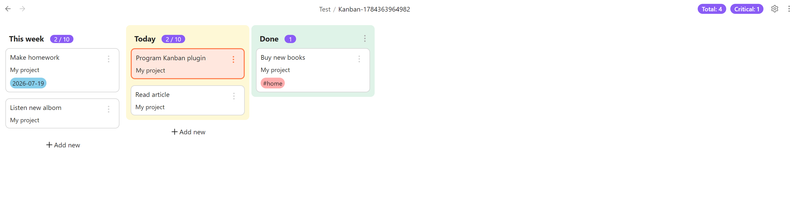

# Task List Kanban

Task List Kanban is a free, open-source Obsidian plugin that turns Markdown tasks from your notes into a live Kanban board. Keep tasks in their original files while planning, prioritising, and completing them from one visual workspace.

Changes made on the board are written back to the source note, so there is no separate task database to maintain.



## Features

- Automatically collects Markdown tasks from the Kanban file's folder or the entire vault.
- Organises tasks into configurable columns by using tags.
- Moves tasks between columns with drag and drop or the task menu.
- Creates tasks directly from a column with **Add new**.
- Edits task text, tags, and due dates without leaving the board.
- Opens the source note from a task and shows its file name on the card.
- Supports Markdown rendering, links, emoji, and multiline task content.
- Provides quick actions for priorities, due dates, project changes, completion, archiving, and deletion.
- Sorts cards by one or more criteria: priority, due date, status change date, creation date, path, or source row.
- Filters the project files offered by **Add new** and **Change project**.
- Archives every task in a column from the column menu.

## Recent highlights

### Coloured columns

Assign a colour to each custom column and choose a separate colour for the built-in **Done** column. Colours make board stages easier to scan while remaining compatible with Obsidian themes.

### Work-in-progress limits

Set an optional maximum task count for every custom column. The column badge shows `current / maximum` and is highlighted when the limit is exceeded. Leave the maximum empty for an unlimited column.

### Configurable header counters

Add any number of counters beside the settings button. Each counter has its own label, filter, and optional maximum. When a maximum is exceeded, the counter is highlighted.

The default counters show tasks due within the next seven days and critical upcoming tasks. Counter filters support:

- Tags: `tags: #work, #personal`
- Priorities: `priority: #p0, #p1`
- Relative due dates: `due: < today() + 7d`
- Combined conditions: `due: < today() + 7d tags: #work priority: #p0, #p1`

Comma-separated values within one filter group match any listed value. Different filter groups are combined.

### Priority and due-date styling

Priority tasks receive a stronger coloured border and background. Due-date badges distinguish overdue, due-today, upcoming, and later tasks, making urgent work visible at a glance.

### Flexible card details

Choose whether tags appear as coloured footer badges or remain inline with the task text. Cards show the source file name, with the full path available as a tooltip.

## Getting started

1. Enable Task List Kanban in Obsidian.
2. Right-click a folder and select **New kanban**.
3. Add Markdown tasks to notes in that folder, for example:

   ```markdown
   - [ ] Write release notes #Today #p1 2026-07-19
   ```

4. Open the generated Kanban file. Tasks without a column tag appear in **Uncategorised**.
5. Drag a card into a column. The plugin updates the corresponding tag in the source note automatically.

Column tags are used internally to connect tasks to board columns and are hidden from the rendered card text. A task can belong to one Kanban column at a time; other tags remain available for organisation and display.

## Board settings

Open the gear menu in the top-right corner of the board to configure:

- **Columns** — add, rename, delete, recolour, and set task limits for custom columns.
- **Done column colour** — style the built-in completion column separately.
- **Header counters** — add, edit, or remove filtered counters.
- **Folder scope** — scan only the current folder or every folder in the vault.
- **Display tags in footer** — render tags as coloured badges instead of inline text.
- **Match Pattern / No Match Pattern** — control which project files are offered by **Add new** and **Change project**.
- **Sort Order** — provide a comma-separated sequence of supported sort criteria.

### Filtering project files

The **Match Pattern** and **No Match Pattern** settings filter project file names in the file picker that opens when you add a card or change an existing card's project:

- **Match Pattern** includes only file names that match the pattern.
- **No Match Pattern** excludes file names that match the pattern.

For example, use `^Project-` as the match pattern to show only files whose names start with `Project-`, or use `Archive` as the no-match pattern to hide archived project files. Leave either setting empty when that filter is not needed.

> [!IMPORTANT]
> Renaming a column does not automatically rewrite the old column tag in existing notes. Tasks still using the previous tag will move to **Uncategorised** until reassigned.

## Managing tasks

Use a card's menu to:

- open its source file;
- move it to another column or **Done**;
- set priority `p0` through `p3`;
- set the due date to today, tomorrow, or next week, or remove it;
- move it to another project file;
- archive or delete it.

Click the task text to edit it in place. Press **Enter** to save, **Shift+Enter** to add a line, or **Escape** to finish editing.

## Development

The plugin is built with TypeScript, Svelte, and the Obsidian API.

```bash
git clone <repository-url>
cd task-list-kanban
npm install
npm run dev
```

Available commands:

- `npm run dev` — build in development mode and watch for changes.
- `npm run build` — type-check and create a production build.
- `npm test` — run the test suite.
- `npm run release` — bump the version and prepare release files.

Contributions and bug reports are welcome.

## License

[MIT](LICENSE)
