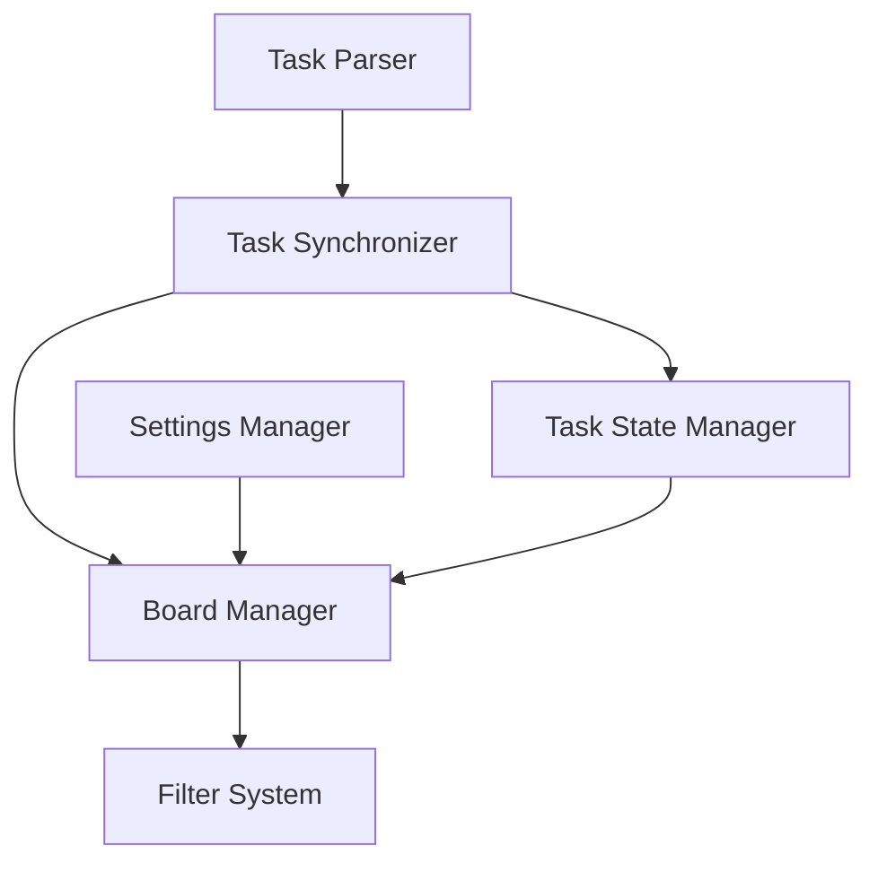

# Task List Kanban - Architecture Document

## System Overview
Task List Kanban is built as an Obsidian plugin using TypeScript and Svelte, following a component-based architecture that integrates with Obsidian's plugin API.

## Core Components

### 1. Task Management System
- **Task Parser**
  - Scans Obsidian files for task markers
  - Extracts task content and metadata
  - Parses tags and column assignments
  - Processes date-related metadata
    - Due dates from task content
    - Status change tracking
    - Date format standardization

- **Task Synchronizer**
  - Maintains bidirectional sync between Kanban and files
  - Handles task updates and state changes
  - Manages file modifications
  - Ensures date consistency across updates

- **Task Sorter**
  - Implements multi-level sorting strategy
  - Handles priority-based ordering
  - Processes date-based comparisons
  - Maintains consistent task order

### 2. Kanban View System
- **Board Manager**
  - Manages column configurations
  - Handles task distribution across columns
  - Controls drag-and-drop operations

- **Filter System**
  - Processes tag-based filters
  - Manages filter state
  - Updates view based on active filters

### 3. Storage System
- **Settings Manager**
  - Handles column configurations
  - Manages folder scope settings
  - Stores user preferences

- **Task State Manager**
  - Tracks task locations and states
  - Manages archived tasks
  - Handles task persistence

## Component Relationships

## Data Flow
1. Task Detection
   - Monitor file changes
   - Parse task content
   - Extract metadata

2. Task Processing
   - Apply column rules
   - Process tags
   - Update task state

3. View Updates
   - Apply filters
   - Update column contents
   - Refresh UI components

## Integration Points
1. Obsidian API Integration
   - File system access
   - Markdown processing
   - UI integration

2. Plugin System Integration
   - Settings management
   - Event handling
   - View registration

## Security Considerations
1. File Access
   - Respect Obsidian's security model
   - Safe file operations
   - Data integrity protection

2. Data Persistence
   - Safe state management
   - Error recovery
   - Data backup considerations

## Performance Considerations
1. Task Processing
   - Efficient file scanning
   - Optimized updates
   - Minimal reprocessing

2. UI Performance
   - Smooth animations
   - Responsive interactions
   - Efficient rendering

## Error Handling
1. File Operations
   - Handle file access errors
   - Manage sync conflicts
   - Recover from failures

2. User Operations
   - Validate user inputs
   - Handle invalid states
   - Provide error feedback
